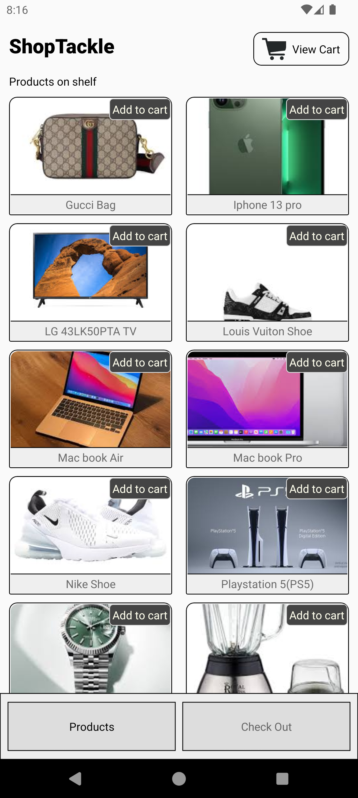
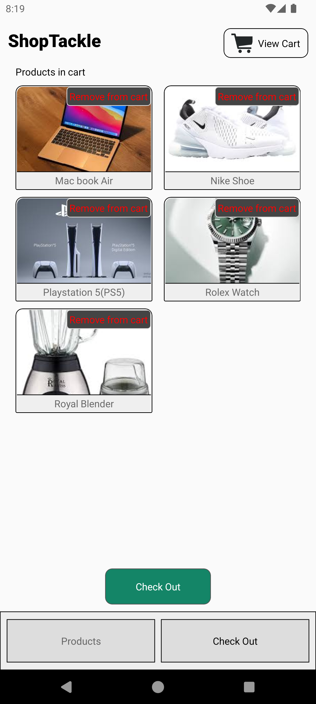
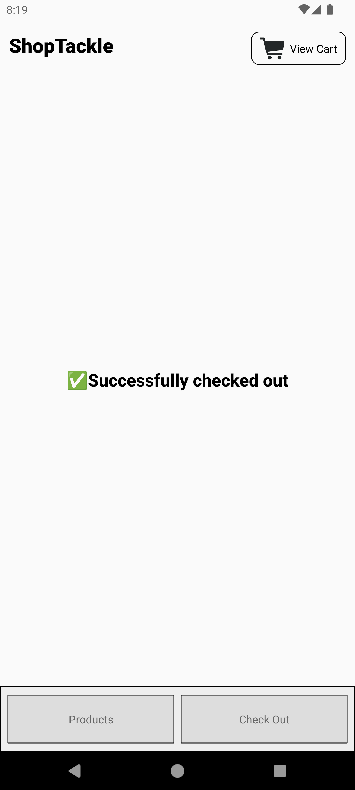

# SHOPTACKLE - A Simple Shopping App
This is a project built with react native expo with absolutely zero dependencies

## Features

- **Bottom Navigation Bar:** Navigate between Products and Checkout screens.
- **Products Screen:** Displays a list of products/items.
- **Checkout Screen:** Shows items added for checkout with add/remove functionality.
- **Order Successful:** Navigate to a confirmation screen from Checkout.

## Tech Stack
- ### Dependencies: Absolutely none
- **Framework:** Built using Expo and React Native.
- **Platform:** Cross-platform app compatible with iOS and Android.

## Setup Instructions:
### Clone Repository:
```bash
   git clone https://github.com/monyasau/shopTackle.git
   cd shopTackle 
```
### Install Dependencies:
```npm install```

### Run the App:
```npx expo start```

## Screenshots:
<!-- 

 -->


## Appetize.io Demo:

Access the demonstration of the **shopTackle** app on Appetize.io:
- [Appetize.io Demo Link](https://appetize.io/app/w4lcdx7fremnditpptl6gicokm)

## App download link:
- [App Download Link](https://expo.dev/artifacts/eas/w4T7tmFa9EEuesovLMgzBv.apk)